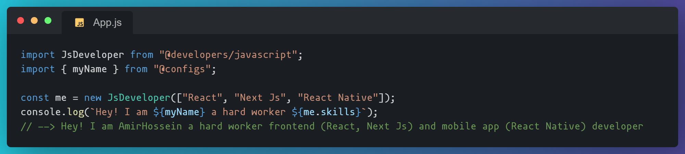

 
 
<h1 align="center">Hi 👋, I'm Amirhossein Abbasgholizade</h1>
<h3 align="center">A passionate frontend developer from Iran Mazabdaran</h3>
  

- 🔭 I’m currently working on [etkala](https://etkala.ir)

- 👨‍💻 All of my projects are available at [https://github.com/amirAbbasG](https://github.com/amirAbbasG)

- 💬 Ask me about **React, Next js, React Native**

- 📫 How to reach me **amir.h.abbas.g@gmail.com**

- 📄 Know about my experiences [https://resume-tau-kohl.vercel.app/](https://resume-tau-kohl.vercel.app/)

 
<h3 align="left">Connect with me:</h3>

<a href="https://instagram.com/ares_1377?igshid=nmq2zmyxzja=" target="blank">&nbsp;&nbsp;</a>

<h3 align="left">Languages and Tools:</h3>
 <a href="https://git-scm.com/" target="_blank" rel="noreferrer"> &nbsp;&nbsp; </a> <a href="https://www.w3.org/html/" target="_blank" rel="noreferrer"> &nbsp;&nbsp; </a> <a href="https://developer.mozilla.org/en-US/docs/Web/JavaScript" target="_blank" rel="noreferrer"> &nbsp;&nbsp; </a> <a href="https://www.mongodb.com/" target="_blank" rel="noreferrer"> &nbsp;&nbsp; </a> <a href="https://nextjs.org/" target="_blank" rel="noreferrer"> &nbsp;&nbsp; </a> <a href="https://nodejs.org" target="_blank" rel="noreferrer"> &nbsp;&nbsp; </a> <a href="https://reactjs.org/" target="_blank" rel="noreferrer"> &nbsp;&nbsp; </a> <a href="https://reactnative.dev/" target="_blank" rel="noreferrer"> &nbsp;&nbsp; </a> <a href="https://redux.js.org" target="_blank" rel="noreferrer"> &nbsp;&nbsp; </a> <a href="https://sass-lang.com" target="_blank" rel="noreferrer"> &nbsp;&nbsp; </a> <a href="https://tailwindcss.com/" target="_blank" rel="noreferrer"> &nbsp;&nbsp; </a> <a href="https://www.typescriptlang.org/" target="_blank" rel="noreferrer"> &nbsp;&nbsp; </a> <a href="https://webpack.js.org" target="_blank" rel="noreferrer"> &nbsp;&nbsp; </a> <a href="https://mui.com" target="_blank" rel="noreferrer"> &nbsp;&nbsp; </a> <a href="https://sass-lang.com" target="_blank" rel="noreferrer"> &nbsp;&nbsp; </a>
 
 
 
 

